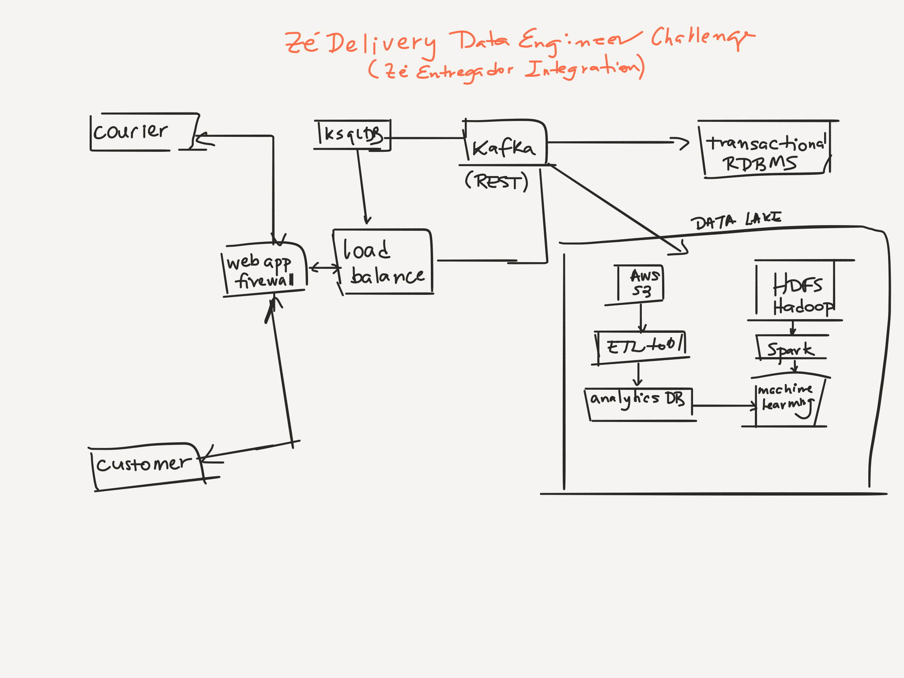

# ZÉ Delivery Data Engineer Challenge

### Author  
* [Bruno F. Bessa]

### Answers to the challenge

* How are we going to receive all the location data from the couriers' app? What protocols, services, components we are going to use to proper receive the data, store it and be available to be used in other products.

 The courier's device for tracking location will send a message through a web application firewall with a collection of data (about the courier, order and off course the location). This data then will be sent to a load balancer (recommended Nginx) and then sent to a Kafka broker. The load balancer component is just for high availability purposes considering there would be more than one environment for the Kafka cluster.
  * Should we create an API for it?

  Yes. All the data would should get into Kafka as a key-value pair and it is a well known practice to send the data as a json (AVRO) using REST APIs.

  * Should we use some specific managed component to receive this information?

  Yes. As mentioned above, this component should be Apache Kafka. This is a good alternative because it is asynchronous and can work with real low latency data. Besides, it is agnostic in terms of which components are going to consume the data.
  * Should we use queues, pub-sub mechanisms, serverless components?

  Kafka already works with data sequentially and offers means for subscriptions to consume the data.
* While receiving this location data associated with order's information, imagine we need to ingest more information to it.
  * How would we do this?

  We would need Kafka Schema-Registry, by Confluent in order to set a field informing that the order id is written or updated.
  * In which layer that you have proposed in the previous answer?

  Acquisition Layer
* We need to create an API to retrieve the last retrieved location from an order.
  * How do you propose us to do this?

  Confluent KsqlDB could be used to query data retained in kafka and deliver the results to APIs.
  * While receiving location data, can you elaborate a solution to store the order's last location information?

  Confluent KsqlDB could be used to retrieve information about the courier location topic and locate the latest message.
* If we need to notify the users about each order's status, how would you implement this while collecting the data?

  If we used microservices to trigger change in order details to the database, an application could be used to send a message to a specific notification topic. And another application would consume this topic and deliver the messages to customers mobile apps.
* How to store the data and how to make it available to be queried by our Data Analytics team?

  Data in Kafka could be used to input applications and data lake as well. The data lake could be designed in different ways:

  HDFS/Apache Hadoop system to query and analyze data wirk Apache Spark and use MLlib to make real time machine learning scoring.
  AWS S3 to store the avro files from topics (written with Confluent Kafka Connect, for example) and then use some ETL tool like AWS Data Pipeline, Apache Airflow, Apache Nifi to construct the data warehouse tables for analytics purposes.

